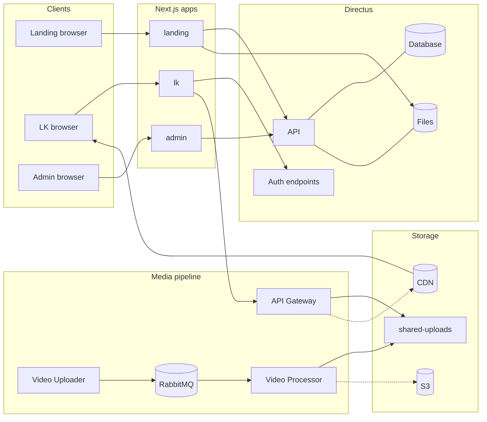
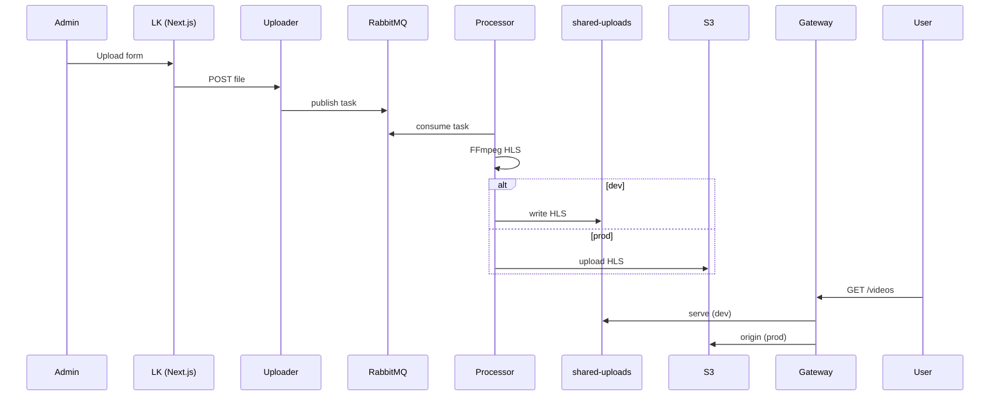
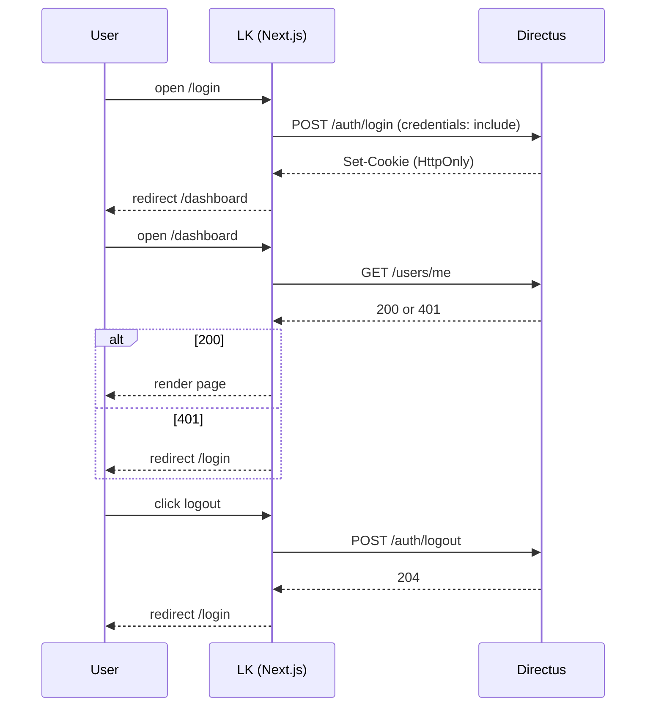

# Архитектура проекта GARMONIA

## 1. Общий обзор
Проект **GARMONIA** — это веб-платформа с авторизацией, системой управления пользователями, защищённым доступом к контенту (видео) и интеграцией с Headless CMS **Directus**.

### Основная цель
- Предоставление пользователям защищённого доступа к контенту (видеоматериалы) через авторизацию.
- Управление пользователями и контентом через Directus.
- Масштабируемая архитектура с разделением фронтенда и бэкенда.

---

## 2. Структура системы

### 2.1. Фронтенд
- **Технологии**:
    - [Next.js](https://nextjs.org/) — фреймворк React с SSR и маршрутизацией.
    - [Tailwind CSS](https://tailwindcss.com/) — утилитарный CSS-фреймворк для стилизации.
    - [TypeScript](https://www.typescriptlang.org/) — строгая типизация.
- **UI-библиотеки и подходы**:
    - Компонентный подход React.
    - Градиенты, фоновые изображения через Tailwind.
    - Навигация с использованием `next/link`.
- **Авторизация**:
    - Логин/регистрация через API Directus.
    - Сессия хранится в **HttpOnly cookie** (через `credentials: "include"`).
    - Проверка авторизации при загрузке страниц (fetch `/users/me`).

---

### 2.2. Бэкенд
- **Directus** — headless CMS, выполняет роль API и панели администратора.
- **Docker Compose** используется для поднятия Directus с нужной БД и конфигурацией.
- **PostgreSQL** как основная база данных.
- Авторизация пользователей:
    - `/auth/login` — аутентификация.
    - `/auth/logout` — завершение сессии.
    - `/users` — управление данными пользователя.
- Контент (видео) хранится в S3-совместимом хранилище (MinIO или Amazon S3).

---

### 2.3. API Gateway (Node.js + Express)
- Обеспечивает проксирование запросов к сервисам.
- Подключает middleware для проверки JWT.
- Обрабатывает маршруты для видео, доступные только авторизованным пользователям.

---

## 3. Интеграции и сервисы

| Сервис / Библиотека | Назначение |
|--------------------|------------|
| **Directus**       | CMS и API для пользователей и контента |
| **PostgreSQL**     | Реляционная база данных |
| **S3 (MinIO/Amazon)** | Хранилище видео и медиафайлов |
| **Next.js**        | Фронтенд и рендеринг |
| **Tailwind CSS**   | Стилизация UI |
| **Node.js + Express** | API Gateway, маршрутизация |
| **JWT**            | Авторизация между сервисами |

---

## 4. Хранение данных
- **Пользователи**: таблица `directus_users` в PostgreSQL (управляется Directus).
- **Видео**: метаданные в Directus, файлы — в S3.
- **Сессии**: хранятся на стороне сервера (Directus) и передаются клиенту через `HttpOnly` cookie.

---

## 5. Поток авторизации

1. Пользователь заходит на страницу входа.
2. Отправляет логин и пароль в Directus `/auth/login`.
3. Directus создаёт сессию и возвращает `HttpOnly` cookie.
4. Фронтенд отправляет запросы с `credentials: "include"`.
5. API проверяет пользователя через `/users/me`.
6. При выходе (`/auth/logout`) сессия уничтожается.

---

## 6. Безопасность
- **HttpOnly cookies** для токенов.
- CORS настроен на доверенные домены.
- Закрытые API маршруты защищены JWT middleware.
- Минимизация хранения чувствительных данных на клиенте.

## Диаграммы

### High‑level архитектура


### Поток загрузки/выдачи видео


### Поток аутентификации


## CI/CD для лендинга (frontend-apps-landing)
Ниже — минимальный рабочий конвейер под GitHub Actions → GHCR → деплой на Ubuntu‑ВМ в Яндекс Облаке через SSH + Docker Compose. Сейчас он триггерится только на изменения в `frontend-apps-landing/**`.

### Файлы, которые нужно добавить в репозиторий

**1) `.github/workflows/cicd.yml`**
```yaml
name: CI/CD monorepo (landing)

on:
  push:
    branches: [ main ]
    paths:
      - 'frontend-apps-landing/**'
      - '.github/workflows/cicd.yml'
  workflow_dispatch:

permissions:
  contents: read
  packages: write

concurrency:
  group: cicd-${{ github.ref }}
  cancel-in-progress: true

jobs:
  build-and-push:
    name: Build & Push landing
    runs-on: ubuntu-latest
    steps:
      - uses: actions/checkout@v4

      - name: Set image tag
        id: meta
        run: |
          SHORT_SHA=${GITHUB_SHA::7}
          echo "tag=main-${SHORT_SHA}" >> $GITHUB_OUTPUT

      - name: Login to GHCR
        uses: docker/login-action@v3
        with:
          registry: ghcr.io
          username: ${{ github.actor }}
          password: ${{ secrets.GITHUB_TOKEN }}

      - name: Build & push image
        uses: docker/build-push-action@v6
        with:
          context: ./frontend-apps-landing
          push: true
          tags: ghcr.io/${{ github.repository }}/frontend-apps-landing:${{ steps.meta.outputs.tag }}
          provenance: false

      - name: Expose image tag
        id: expose
        run: echo "IMAGE_TAG=${{ steps.meta.outputs.tag }}" >> $GITHUB_OUTPUT

    outputs:
      landing_tag: ${{ steps.expose.outputs.IMAGE_TAG }}

  deploy-landing:
    name: Deploy to YaCloud VM
    needs: build-and-push
    runs-on: ubuntu-latest
    steps:
      - uses: actions/checkout@v4

      - name: Copy compose & deploy script
        uses: appleboy/scp-action@v0.1.7
        with:
          host: ${{ secrets.YC_HOST }}
          username: ${{ secrets.YC_USER }}
          key: ${{ secrets.YC_SSH_KEY }}
          source: "deploy/landing.compose.yml,deploy/landing.deploy.sh"
          target: "/opt/garmonia_tmp"

      - name: Run deploy script
        uses: appleboy/ssh-action@v1.2.0
        env:
          IMAGE_TAG: ${{ needs.build-and-push.outputs.landing_tag }}
          GHCR_USER: ${{ secrets.GHCR_USER || github.actor }}
          GHCR_TOKEN: ${{ secrets.GHCR_TOKEN || secrets.GITHUB_TOKEN }}
        with:
          host: ${{ secrets.YC_HOST }}
          username: ${{ secrets.YC_USER }}
          key: ${{ secrets.YC_SSH_KEY }}
          script_stop: true
          script: |
            sudo mkdir -p /opt/garmonia
            sudo mv /opt/garmonia_tmp/landing.compose.yml /opt/garmonia/landing.compose.yml
            sudo mv /opt/garmonia_tmp/landing.deploy.sh /opt/garmonia/landing.deploy.sh
            sudo chmod +x /opt/garmonia/landing.deploy.sh
            export IMAGE_TAG="${IMAGE_TAG}"
            export GHCR_USER="${GHCR_USER}"
            export GHCR_TOKEN="${GHCR_TOKEN}"
            /opt/garmonia/landing.deploy.sh
```

**2) `deploy/landing.compose.yml`**
```yaml
name: garmonia-landing
services:
  landing:
    image: ghcr.io/OWNER/REPO/frontend-apps-landing:${IMAGE_TAG}
    restart: unless-stopped
    env_file:
      - /opt/garmonia/landing.env
    ports:
      - "3000:3000"
    networks:
      - web
networks:
  web:
    external: true
```
> Замените `OWNER/REPO` на ваш `github_owner/repo`. В GH Actions переменная `${{ github.repository }}` уже подставляет корректное значение при пуше образа; в compose оставляем явный `OWNER/REPO` для читаемости.

**3) `deploy/landing.deploy.sh`**
```bash
#!/usr/bin/env bash
set -euo pipefail

STACK_DIR="/opt/garmonia"
COMPOSE_FILE="$STACK_DIR/landing.compose.yml"
IMAGE="ghcr.io/OWNER/REPO/frontend-apps-landing:${IMAGE_TAG}"

echo "[landing] docker login ghcr.io"
echo $GHCR_TOKEN | docker login ghcr.io -u $GHCR_USER --password-stdin

mkdir -p "$STACK_DIR"
cp "$COMPOSE_FILE" "$COMPOSE_FILE.bak" 2>/dev/null || true

# убедимся, что compose файл на месте (копируется в шаге scp)
ls -la "$COMPOSE_FILE"

echo "[landing] pulling $IMAGE"
docker pull "$IMAGE"

echo "[landing] up -d"
IMAGE_TAG="${IMAGE_TAG}" docker compose -f "$COMPOSE_FILE" up -d

echo "[landing] prune old images"
docker image prune -f || true
```

**4) `frontend-apps-landing/Dockerfile`** (если ещё нет)
```Dockerfile
# --- build ---
FROM node:20-alpine AS deps
WORKDIR /app
COPY package.json package-lock.json* pnpm-lock.yaml* yarn.lock* ./
RUN \
  if [ -f pnpm-lock.yaml ]; then npm i -g pnpm && pnpm i --frozen-lockfile; \
  elif [ -f yarn.lock ]; then yarn --frozen-lockfile; \
  else npm ci; fi
COPY . .
ENV NEXT_TELEMETRY_DISABLED=1
RUN \
  if [ -f pnpm-lock.yaml ]; then pnpm build; \
  elif [ -f yarn.lock ]; then yarn build; \
  else npm run build; fi

# --- runtime ---
FROM node:20-alpine AS runner
WORKDIR /app
ENV NODE_ENV=production NEXT_TELEMETRY_DISABLED=1
COPY --from=deps /app/.next ./.next
COPY --from=deps /app/public ./public
COPY --from=deps /app/package.json ./
EXPOSE 3000
CMD ["node","node_modules/next/dist/bin/next","start","-p","3000"]
```

### Секреты GitHub Actions (Repo → Settings → Secrets and variables → Actions)
- `YC_HOST` — публичный IP вашей ВМ.
- `YC_USER` — пользователь на сервере (например, `ubuntu`).
- `YC_SSH_KEY` — приватный SSH‑ключ (PEM) с доступом к ВМ.
- `GHCR_TOKEN` *(опционально)* — PAT с `write:packages`. Если не задан, используется `GITHUB_TOKEN`.
- `GHCR_USER` *(опционально)* — имя пользователя GitHub для логина в GHCR (по умолчанию берём `github.actor`).

### Подготовка сервера (один раз)
```bash
curl -fsSL https://get.docker.com | sh
sudo usermod -aG docker $USER
newgrp docker

docker network create web || true

sudo mkdir -p /opt/garmonia
sudo bash -c 'cat > /opt/garmonia/landing.env << EOF
NODE_ENV=production
NEXT_PUBLIC_API_URL=https://api.example.com
EOF'
```

### Роллбек версии
На сервере:
```bash
export IMAGE_TAG=main-ABC1234
/opt/garmonia/landing.deploy.sh
```

### Что будет дальше
- Когда подтвердим, что деплой лендинга стабилен, добавим аналогичные jobs для `lk` и `admin`, а затем вынесем backend‑сервисы (Directus, Gateway, Processor, RabbitMQ) с отдельными compose‑стеками.
