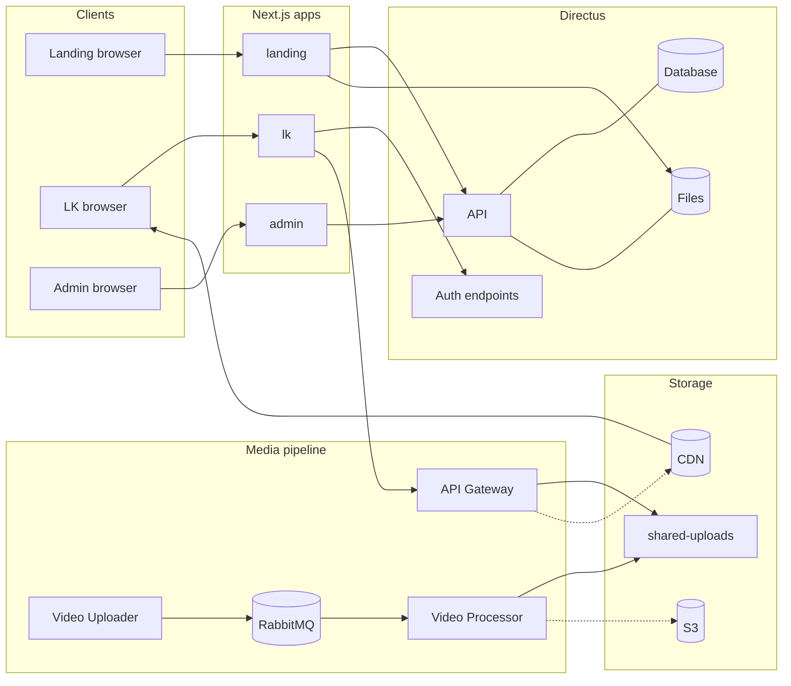
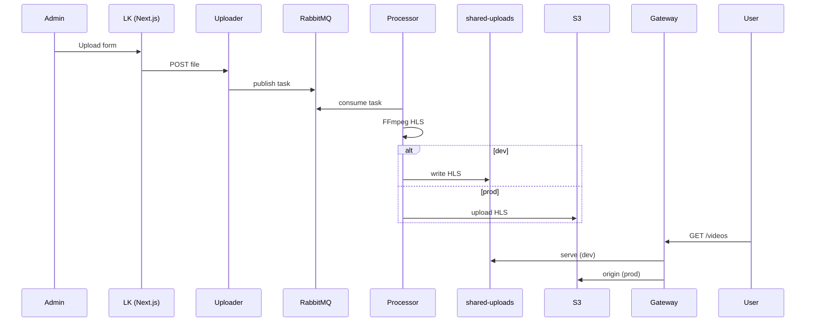
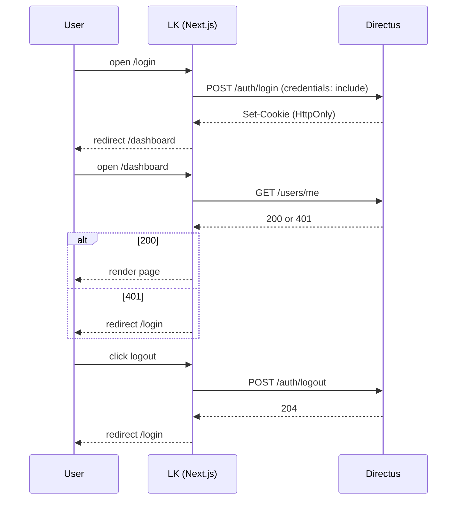

# Архитектура проекта GARMONIA

## 1. Общий обзор
Проект **GARMONIA** — это веб-платформа с авторизацией, системой управления пользователями, защищённым доступом к контенту (видео) и интеграцией с Headless CMS **Directus**.

### Основная цель
- Предоставление пользователям защищённого доступа к контенту (видеоматериалы) через авторизацию.
- Управление пользователями и контентом через Directus.
- Масштабируемая архитектура с разделением фронтенда и бэкенда.

---

## 2. Структура системы

### 2.1. Фронтенд
- **Технологии**:
    - [Next.js](https://nextjs.org/) — фреймворк React с SSR и маршрутизацией.
    - [Tailwind CSS](https://tailwindcss.com/) — утилитарный CSS-фреймворк для стилизации.
    - [TypeScript](https://www.typescriptlang.org/) — строгая типизация.
- **UI-библиотеки и подходы**:
    - Компонентный подход React.
    - Градиенты, фоновые изображения через Tailwind.
    - Навигация с использованием `next/link`.
- **Авторизация**:
    - Логин/регистрация через API Directus.
    - Сессия хранится в **HttpOnly cookie** (через `credentials: "include"`).
    - Проверка авторизации при загрузке страниц (fetch `/users/me`).

---

### 2.2. Бэкенд
- **Directus** — headless CMS, выполняет роль API и панели администратора.
- **Docker Compose** используется для поднятия Directus с нужной БД и конфигурацией.
- **PostgreSQL** как основная база данных.
- Авторизация пользователей:
    - `/auth/login` — аутентификация.
    - `/auth/logout` — завершение сессии.
    - `/users` — управление данными пользователя.
- Контент (видео) хранится в S3-совместимом хранилище (MinIO или Amazon S3).

---

### 2.3. API Gateway (Node.js + Express)
- Обеспечивает проксирование запросов к сервисам.
- Подключает middleware для проверки JWT.
- Обрабатывает маршруты для видео, доступные только авторизованным пользователям.

---

## 3. Интеграции и сервисы

| Сервис / Библиотека | Назначение |
|--------------------|------------|
| **Directus**       | CMS и API для пользователей и контента |
| **PostgreSQL**     | Реляционная база данных |
| **S3 (MinIO/Amazon)** | Хранилище видео и медиафайлов |
| **Next.js**        | Фронтенд и рендеринг |
| **Tailwind CSS**   | Стилизация UI |
| **Node.js + Express** | API Gateway, маршрутизация |
| **JWT**            | Авторизация между сервисами |

---

## 4. Хранение данных
- **Пользователи**: таблица `directus_users` в PostgreSQL (управляется Directus).
- **Видео**: метаданные в Directus, файлы — в S3.
- **Сессии**: хранятся на стороне сервера (Directus) и передаются клиенту через `HttpOnly` cookie.

---

## 5. Поток авторизации

1. Пользователь заходит на страницу входа.
2. Отправляет логин и пароль в Directus `/auth/login`.
3. Directus создаёт сессию и возвращает `HttpOnly` cookie.
4. Фронтенд отправляет запросы с `credentials: "include"`.
5. API проверяет пользователя через `/users/me`.
6. При выходе (`/auth/logout`) сессия уничтожается.

---

## 6. Безопасность
- **HttpOnly cookies** для токенов.
- CORS настроен на доверенные домены.
- Закрытые API маршруты защищены JWT middleware.
- Минимизация хранения чувствительных данных на клиенте.

## Диаграммы

### High‑level архитектура

### Поток загрузки/выдачи видео

### Поток аутентификации

